# Covnets Visualization: Image gradients, DeConvNets, Fooling images, DeepDream and more. 

In my previous, I had talked about how to use ConvNets to perform [image classification](https://kapilddatascience.wordpress.com/2017/01/08/convolution-network-from-3-layer-covnets-to-a-deep-layered-network/) on CIFAR-10 data set. Additionally, I touched upon how to use RNN and LSTM to perform [Image Capitioning](https://kapilddatascience.wordpress.com/2017/01/07/image-captioning-using-rnn-and-lstm/) on images. We know that Deep learning works for all these tasks which is a good thing. However, it would be worth exploring what really happens under the hood. 


In this post, I will talk about how one can visualize Convolution Networks. Also, I will mention how one can use image gradients to generate Images, to create beautiful art and even fool the classfier. 


## Visualizing Convolution Network.
There are many ways you can peform visulization of CovNets. 

1. **Vizualize patches that maximally activate a neuron**.
	- This means you pick any layer in a CovNet (say Pool5) and send lots of images through it. Then you pick a neuron and check what images excites that neuron the most. This can help us visualize patches that helps neuron.

2. **Vizualize weights**.
	- Second option is to take a look at weights and visualize them. For for a given layer, just visualize all of their weights. The only drawback with this approach is that only weights from first layer are interpretable. Its hard to interpret weights from deeper layer.

3. **tSNE with last layer**.
	- Another option is to the take the features from last layer of the neural network. Note: these are the raw features in a higher dimension space (say 4096) which are fed to softmax. 
	- Take these features (4096 of them), and visualize the images behind those features using a dimensionality reduction technique say [tSNE](https://en.wikipedia.org/wiki/T-distributed_stochastic_neighbor_embedding). This technique will cluster images close to each other in 2 dimensional space as they are close to each other in higher dimension space. 

4. **Occlusion experiment 	[1]**. 
	- In this technique, you take a sliding window and run it over the image. For each window, you mark the pixel of that part of the image as zero and then find the understand how the probablity of that class changes with respect to the position of the window. 
	- Then plot the heat map of that the probablity projected on the image. 
	- One will notice the low intensity heat map at the position which was to used classify that part of the image.  	

4. **Deep Visualization tool box 	[2]**. 
	- This is a software based approach, where you can visualize weights of neuron at any layer of the convets. 
	- Ex: you can pass your camera feed and observe the neurons getting activated at different layer of network.
	- Check out [this video](https://www.youtube.com/watch?v=AgkfIQ4IGaM) to get more information. 

Now, lets talk about two more ways to generate these images via DeConv approach or Optimization based approach.
	
## DeConv approach [1] [3]:
- This is again a image visulization technique but it works by taking teh gradient of an neuron using a "guided" backpropogation technique.
- Steps are as follows
 - You pick a neuron which you want to visualized from any of the layers of the network.
 - Take a image and run backward prop. uptill that neuron and take its gradient. This is done at the ReLu layer.
 - Then expect for that neuron set all the gradients to be zero and then backprop. When the image is reconstructed at the end, one can observe some nice gradient based image. 
 - **guided backpropagation** : However, with guided backpropagation: Instead of only zeroing the gradients which have zero Relu activations, we also zero those gradients which have non-zero values.  
 - This will give us a nice vizualization after many Conv, Relu, Conv Relu layer etc.

## Optimization based technique[4].
- Next we will try some optimization based approach.
- In this approach, we don't change our ConNets but only optimize on image and nots its weights. 
- Intutively, we are trying to find image which tries to maximize the class score (using some regularization).

![bar] (./pics/max.png)

### Image based optimization
- In this technique we maximize the image.
- We start with a random image.
- At the last layer(before softmax layer), set the gradient for all classes (expect the class to be optimized) to be zero. Basically, set the gradients for un normalized log probablities(scores)
- Then backprop, and iterate. 

```
Update the Image I = I + learning rate * dX
where dX = dx + regularized gradient
```
- Note we use gradient descent to find the gradient dX using back prop, but we use gradient ascent to maximize the image.
Thus for a given case we can find a image that maximise the class score. 
- Code looks like this

	```
	 X = randomImage()
	 // add some jittering for regularization
    dX = None
    // run forward pass
    scores, cache = model.forward(X, mode='test')
    dscores = np.zeros_like(scores)
    // set gradients expect for the target class to be zero.
    dscores[0, target_y] = 1
    dx, grads = model.backward(dscores, cache)
    dX = dx  + 2 * l2_reg * X
	// update the image using gradient descent.
    X = X + learning_rate * dX

	
	```
- For the following image class in ImageNet data set
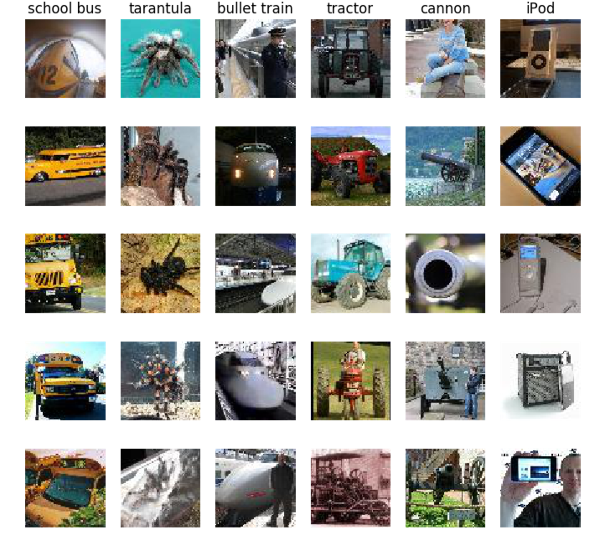  	

One gets the following image which is maximized on the class. 


school bus|  Taruntula | Bullet train  |Tractor| iPod
:-------------------------:|:-------------------------:|:-------------------------:|:-------------------------:|:-------------------------:
  |     |  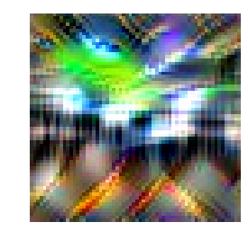  |  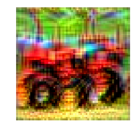   |  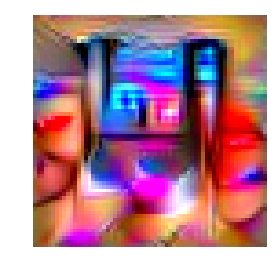 

### Visualize the Data gradients using Max.[4]:
- This is another way to visualize the gradients of the image. 
- Steps are as follows:
 - Take an image which has a known target class, 
 - Run forward pass on it, At the last layer(before softmax layer), set the gradient for all classes (expect the class to be optimized) to be zero. Basically, set the gradients for un normalized log probablities(scores)
 - Then backprop.
 - Now squash the gradients of the image in a way that you take a max of the absoulte value of the pixels alongs all the dimensions of a particular channel. 
 - In code it looks like this

 ```
   scores, cache = model.forward(X, mode='test')
  dscores = np.zeros_like(scores)
  dscores[np.arange(N), y] = 1
  dX, _ = model.backward(dscores, cache)
  saliency =  np.amax(np.absolute(dX), axis=1)
  ```

  - Now when you can plot the saliency objects for some of the images
  -- 
  

--
#Feature Inversion

In this section we will understand if its possible to re-construct the image from its feature representation. The paper [5] discuss this is more detail. 

- **Mathematically**: In other sense, lets say we have an image I and its activation at layer l being f(i, l), Now our task is to find another image I_hat with similar activation at layer l.

	
	
- Steps to re construct the original image from its feature representation. (Think of this as an optimization problem on the above function which can be solve by gradient descent.)
 - For a given image, extract ist feature at a given layer from which you want to re-construct the image. This gives you the actual features "feats"
 - Intialize your image with random noise say I_hat.
 - Run gradient descent with the following steps:
 		  -  Run the forward pass on I_hat anf extract features upto the same layer. these are predicted features. 
	   	- Calcualte the loss and the gradients between the predicted features and actual features.
   		- Backprop your grads, to get the final image gradients dX.
	   	- Now, update your image I_hat  with image gradients dX and regularization.

 - Finally, plot the reconstructed image I_hat.
 - code looks like this

	```
  # init() the image to be random.	
  X = np.random.randn(1, 3, 64, 64)

  for t in xrange(num_iterations):
	     scores, cache = model.forward(X, end = layer, mode='test')
	     # error/loss
   		 dout = 2 * (scores - target_feats) 
	     dx, grads = model.backward(dout, cache)
   		 dX = dx  + 2 * l2_reg * X
	     X = X - learning_rate * dX	     	     
 	``` 
	### Here are the reconstructed image dervied from features taken from layer 4 and layer 7. 
	- As you can see reconstructed image from layer 4 is more close to the original image than layer 7.
 	
original image| reconstruction from layer 4| rescontruction from layer 7  
:-------------------------:|:-------------------------:|:-------------------------:|
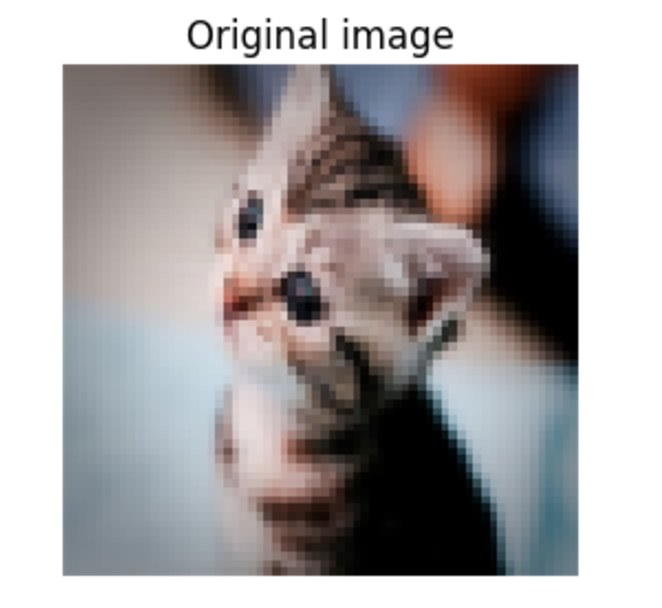  |  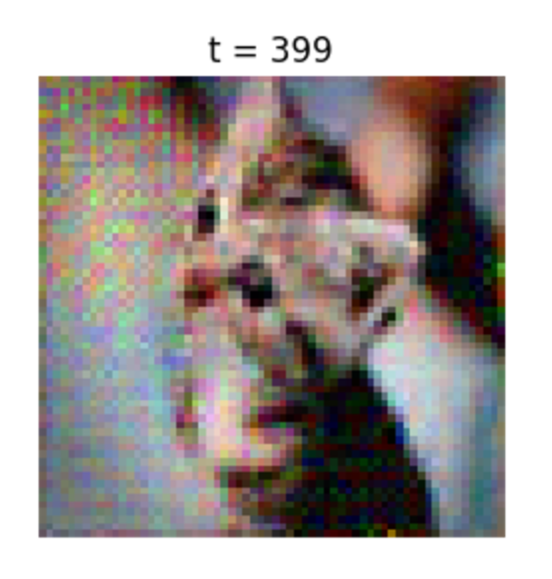   |  
 
-- 


# DeepDream [6]

This is my favorite part of this post. Using [Deep dream](http://googleresearch.blogspot.com/2015/06/inceptionism-going-deeper-into-neural.html), one can generate some really cool, creepy little images from the Conv. net. 

The idea is very simple. We pick some layer from the network, pass the starting image through the network to extract features at the chosen layer, set the gradient at that layer equal to the activations themselves, and then backpropagate to the image

The code looks something like this

```
  X = some given image. 
  
  for t in xrange(num_iterations):
    # As a regularizer, add random jitter to the image
    dX = None
    scores, cache = model.forward(X, end = layer, mode='test')
    dout = scores
    # set the gradient equal to the activations.
    dX, _ = model.backward(dout, cache)
    X = X + learning_rate * dX
    # Undo the jitter
    # As a regularizer, clip the image

```
- One can deep dream at any layer of the Conv Nets.

### Here is how Deep dream looks like on sample images.

## Layer 7	

Original image |  Deep Dream at 75 | Deep Dream at 100  |Deep Dream at 125| Deep Dream at 175| Deep Dream at 200
:-------------------------:|:-------------------------:|:-------------------------:|:-------------------------:|:-------------------------:|:-------------------------:
  |  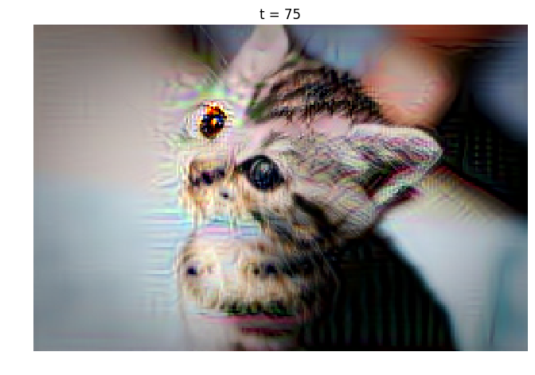   |    |  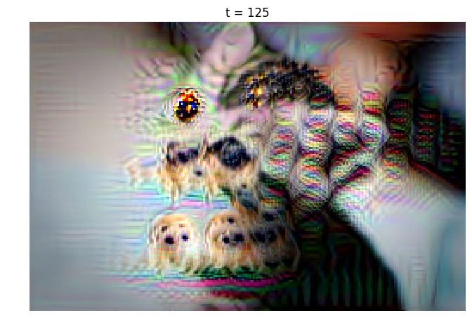   |   |   
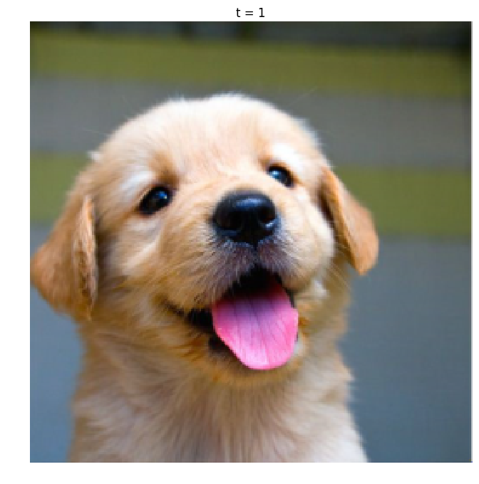  |  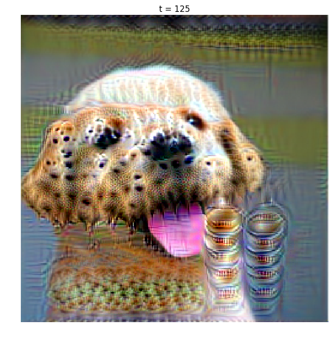   |    |     |  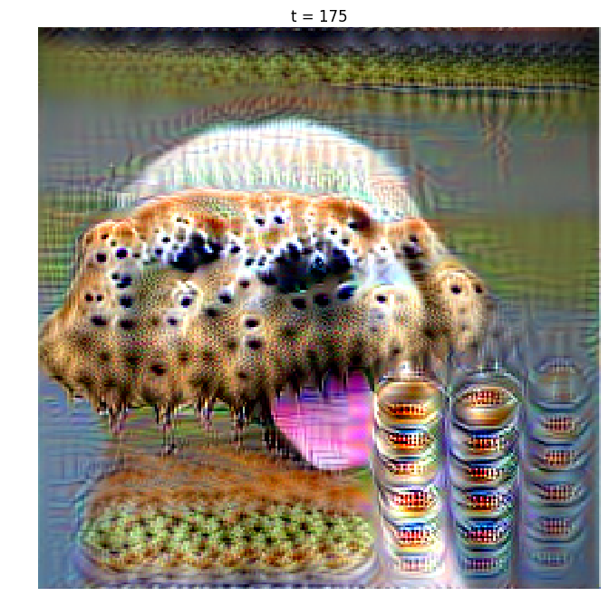 |   
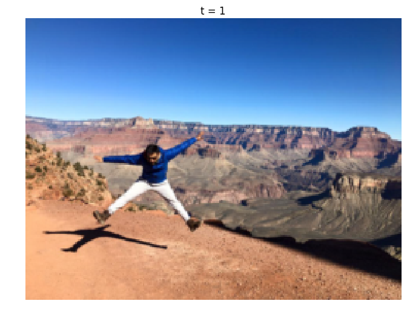  |     |  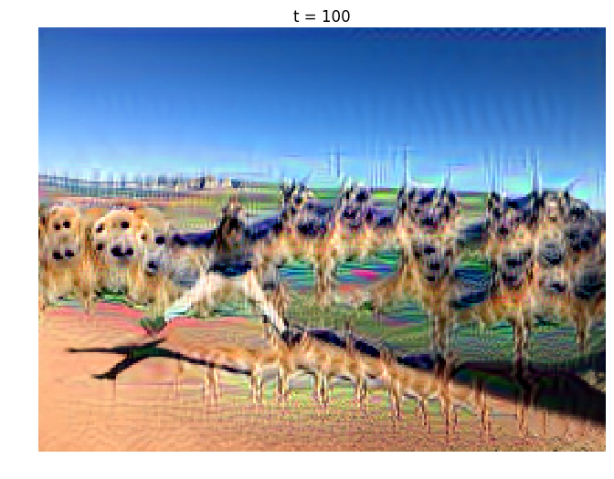  |     |   
  |  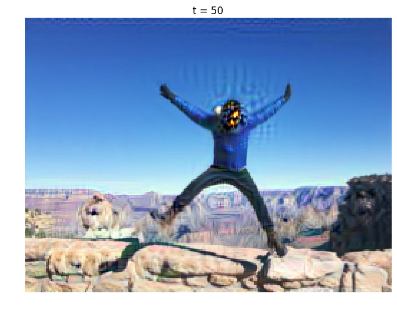   |    |     |  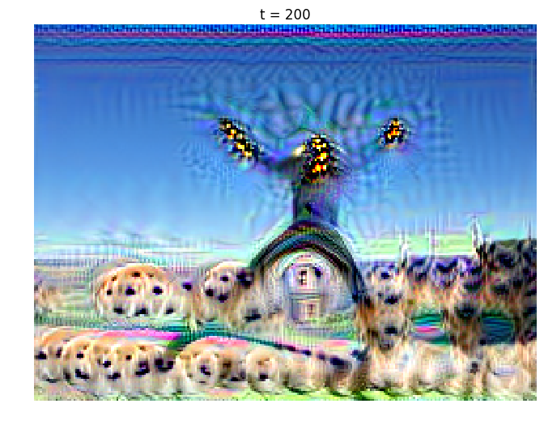 


## Layer 5 vs 7

Original image |  Deep Dream at 75 | Deep Dream at 100  |Deep Dream at 125|Deep Dream at 125
:-------------------------:|:-------------------------:|:-------------------------:|:-------------------------:|:-------------------------:
Layer 5  |  |  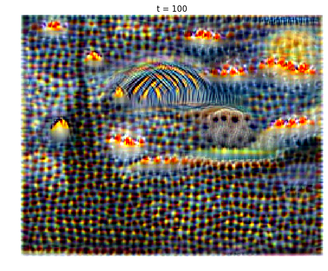   |    |  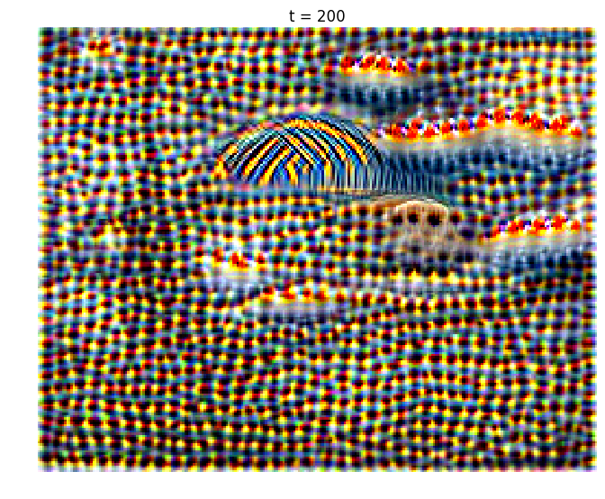  
Layer 7  |  |  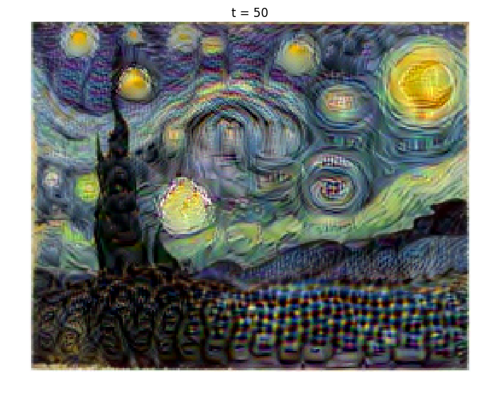   |    |  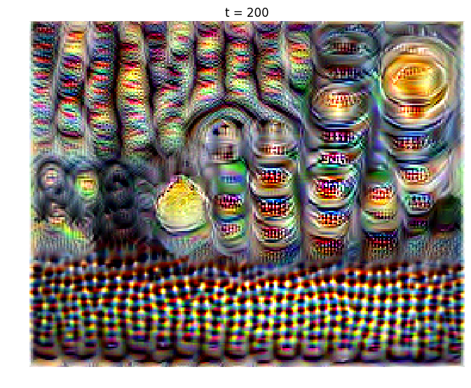    
--

# Fooling images (Adversarial images) [7] [8] [9] [10]

The last topic in this post is how we can fool a Conv. network by adding noise to the original so that it with high confidence it picks some other label class. 

- The important thing to note is that the noise added to the original image doesn't change the image such that a human can identify.
- Also, the issue is not limited to Deep leanring but any linear classifier. 

The steps do this are very similar. 

- Take an input image X which was correcty classified with label "c" 
- Take any target class on which you want to fool the network say label "d"
- Run the forward and backward pass on the image until the predition of the image is "d"
 - Run forward, find the gradients
 - Set the gradients for all classes expect the fooling class to be zero. Set the gradient for the fooling class to be 1.
 - Get the image gradient dX
 - Update your image X using gradient assent. 
 - keep iterating.

### Code:
```
  target_y = label "d"
  break_loop = False
  while break_loop == False:
      scores, cache = model.forward(X_fooling, mode='test')
      predicted_label =  np.argmax(scores[0]) 
    
      if predicted_label == target_y:
         break_loop = True
      else :
          dscores = np.zeros_like(scores)
          dscores[0, target_y] = 1  
          dX, grads = model.backward(dscores, cache)
          X_fooling = X_fooling + 1000 * dX  
  return X_fooling
```

- Here are some sample runs where we take some random input images and fool the classifer to predict it as some other class 
### Images:

Input images fooled as "Tractor" | Input images fooled as "cliff" |
:-------------------------:|:-------------------------:
  |      


----
---


#References: 

- [1]: [Visualizing and Understanding Convolutional Networks - Matthew Zeiler](http://www.matthewzeiler.com/pubs/arxive2013/arxive2013.pdf)

- [2]: [Understanding Neural Networks Through_Deep Visualization] (http://yosinski.com/media/papers/Yosinski__2015__ICML_DL__Understanding_Neural_Networks_Through_Deep_Visualization__.pdf)
- [3]: [Striving for Simplicity: The All Convolutional Net - arXiv.org] (https://arxiv.org/abs/1412.6806)
- [4]: [Deep Inside Convolutional Networks: Visualising Image Classification Models and Saliency Maps](https://arxiv.org/abs/1312.6034)
- [5]: [Understanding Deep Image Representations by Inverting them](https://arxiv.org/abs/1412.0035)
- [6]; [Deep Dream](http://googleresearch.blogspot.com/2015/06/inceptionism-going-deeper-into-neural.html)
-  Fooling images or Adversarial images.
	- [7]	[Deep Neural Networks are Easily Fooled: High Confidence Predictions for Unrecognizable Images](https://arxiv.org/abs/1412.1897)
	- [8]: [Does Deep Learning Have Deep Flaws](http://www.kdnuggets.com/2014/06/deep-learning-deep-flaws.html)
	- [9]: [Deep Learning can be easily fooled](http://www.kdnuggets.com/2015/01/deep-learning-can-be-easily-fooled.html)
	- [10] : [Explaining and Harnessing Adversarial Examples] (https://arxiv.org/abs/1412.6572)